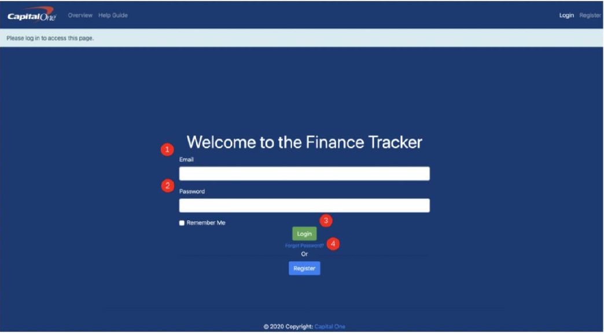
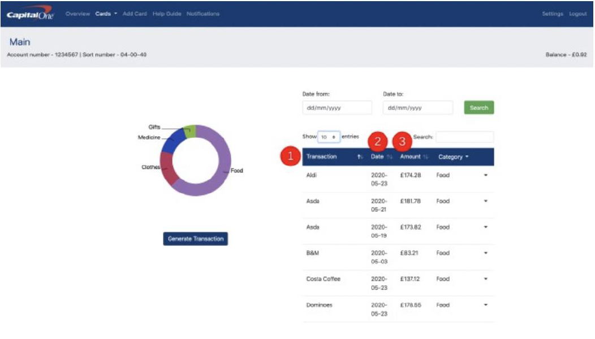
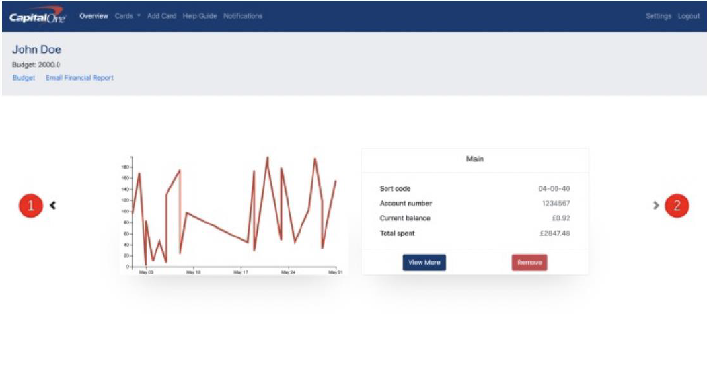

# Spending-Habits-Tracker

Part of my group project at University. The project was outlined by a Capital One sponsor to build a spending habits tracker. The main requirements of the projects were:

- The ability to categorise transactions into categories
- The ability to automatically categorise new transactions
- The ability to view reports on categories of spending over different time periods
- The identification of trends in spending
- The ability to set notifications if spending in a category goes above an amount

## Functionality 🔋

All requirements above were successfully implemented.

The project was primarily built in Python using a framework called Flask. All templates/UI were created using standard HTML and CSS (Bootstrap). 
To integrate the backend with the view components, the template engine Jinja was heavily relied upon. 

  
  
  

 

